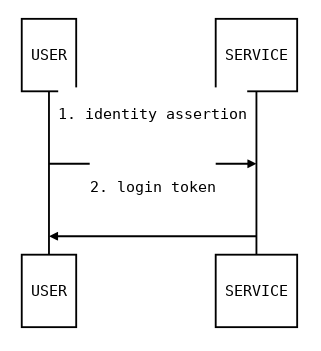
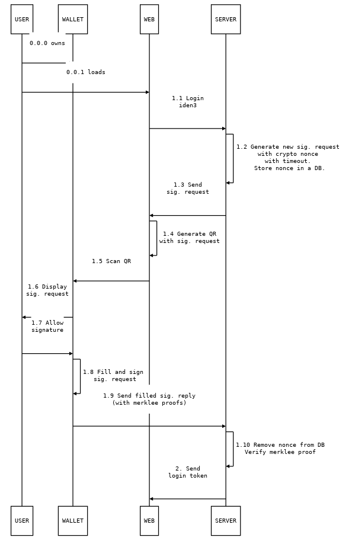

# Login Protocol

## Introduction

The login protocol is based on the signature protocol, in which a user signs a packet using an authorized kSign key. For the login case, the user desires to assert a particular identity (an
Ethereum address in this case) to a server so that s/he is allowed access to the service while being identified.



## Assumptions

-   Secure connection between wallet and server.
-   Secure connection between web client and server.
-   Wallet authenticates the server in the connection.
-   Web client authenticates the server in the connection.

## What is Required?

-   Server authenticates the Ethereum address and Ethereum name from the wallet.
-   The user transfers the authentication from the wallet to the web client.

## Protocol Flow



Challenges contain a cryptographic nonce and have a timeout that
indicates the validity of the nonce in the challenge. A signed challenge with a timed out nonce must be rejected by the server. The server must store a list of the nonces that have not timed out and have not been signed yet to guarantee the freshness.

A cryptographic nonce must be generated securely and must be long enough to avoid collisions (we use 256 bits).

## Signature Protocol v0.1: Specifications

A signature may be requested as follows:

    {
      header: {
        typ: iden3.sig.v0_1
      }
      body: {
        type: TYPE
        data: DATA
      }
    }

Depending upon the signature protocol specifications, a user generates a packet that may contain data from the signature request or can be created from scratch. The packet contains a header and a payload, is serialized, and signed following the [JWS standard](https://tools.ietf.org/html/rfc7515). Usually, the `form` is filled in by the user, and `data` is copied from a request.

The structures of the `data` and the `form` in the payload are specified by the `type` (what is being signed) in the payload. The rest of the elements are specified by the `typ` (signature packet) in the header.

    JWS_PAYLOAD = {
      type: TYPE
      data: DATA
      form: FORM
      ksign: str # ksing public key in compressed form
      proofKSing: proofClaim # Proof of authorize k sign claim (which contains the public key in compressed form)
    }

    JWS_HEADER = {
      typ: iden3.sig.v0_1
      iss: str # Ethereum Address
      iat: uint # issued at time, unix timestamp
      exp: uint # expiration time, unix timestamp
      alg: ? # algorithm
    }

    JWS_SIGN(JWS_HEADER, JWS_PAYLOAD)

Each signature request `type` has a view representation for the user, where the `data` and `form` are presented. Some of the values may be hidden from the user when necessary, but only if doing so doesn’t compromise the security of the user. In the request view, the user has the ability to pick some elements of the `form`.
`ksign` is the compressed public key of a secp256k ECDSA key pair. The `proofKSing` contains a KSign Authorize Claim for a secp256k public key.

As `JWS_HEADER.alg`, we will use a custom algorithm (not defined in the JWS standard): “EK256K1”, which is ECDSA with secp256k1 curve and keccak as a hash function, the same signature algorithm configuration as is used in Ethereum.

### Auxiliary Data Structures

    proofClaim: {
        signature: signature # Relay root + date signed by relay
        date: uint
        leaf: claim
        proofs: proofClaimPartial[]
    }

    proofClaimPartial: {
        mtp0: mtp # merkle tree proof of leaf existence
        mtp1: mtp # merkle tree proof of leaf non-existence
        root: key # merkle tree root
        aux: nil | { ver: uint, era: uint, idAddr: str } # Necessary data to construct SetRootClaim from root
    }

Usually, the relay returns the `proofClaim` data structure to prove that a claim is valid and is in the Merkle tree.

## Identity Assertion v0.1: Specifications

payload:

    type: iden3.iden_assert.v0_1
    data: {
      challenge: nonce # 256 bits in base64
      timeout: uint # seconds
      origin: str # domain
    }
    form: {
      ethName: str # ethereumName
      proofAssignName: proofClaim # proof of claim Assign Name for ethName
    }

A session id, if required, can be computed from the challenge. This session id can be used to link the communication between the web service and the wallet service.

view:

    type: Identity Assertion
    data: {
      origin: str # domain
    }
    form: {
      ethName: str # ethereum name
    }

### Algorithms

In the following sections, we will show an overview of the steps of the algorithms used for verification of the proofs and signatures used in the login protocol. The algorithms below consider the case in which there is a single trusted entity (identified by `relayPk`) that acts as a relay and as a domain name server.

#### Signature Verification Algorithm

    VerifySignedPacket(jwsHeader, jwsPayload, signature, relayPk):
    1. Verify jwsHeader.typ is 'iden3.sig.v0_1'
    2. Verify jwsHeader.alg is 'EK256K1'
    3. Verify that jwsHeader.iat <= now() < jwsHeader.exp 
    4. Verify that jwsPayload.ksign is in jwsPayload.proofKSign.leaf
    5. Verify that jwsHeader.iss is in jwsPayload.proofKSign
    6. Verify that signature of JWS(jwsHeader, jwsPayload) by jwsPayload.ksign is signature
    7. VerifyProofOfClaim(jwsPayload.proofKSign, relayPk)

In step 4 above, we verify that the ksign used to sign the packet is authorized by the user and is identified by the jwsHeader.iss Ethereum address.

### Iden Assert Verification Algorithm

    VerifyIdenAssertV01(nonceDB, origin, jwsHeader, jwsPayload, signature, relayPk):
    1. Verify jwsPayload.type is 'iden3.iden_assert.v0_1'
    2. Verify jwsPayload.data.origin is origin
    3. Verify jwsPayload.data.challenge is in nonceDB and hasn't expired, delete it
    4. Verify that jwsHeader.iss and jwsPayload.form.ethName are in jwsPayload.proofAssignName.leaf
    5. VerifyProofOfClaim(jwsPayload.form.ethName, relayPk)

#### Proof of Claim Verification

    VerifyProofOfClaim(p, relayPk):
    1. Verify signature of p.proofs[-1].root by relayPk is p.signature
       let leaf = p.leaf
    2. loop for each proof in p.proofs:
        2.1 Verify proof.mtp0 is existence proof
        2.2 Verify proof.mtp0 with leaf and proof.root
        2.3 Verify proof.mtp1 is non-existence proof
        2.4 Verify proof.mtp1 with ClaimIncrementVersion(leaf) and proof.root
            leaf = NewClaimSetRootClaim(p.root, p.aux.ver, p.aux.era, p.aux.ethAddr)

<!-- ### Rationale

See [this document](login_spec_rationale.md) for the rationale of some
decisions made in the design of this protocol. -->

## iden3js Protocols

### Login (Identity Assertion)

    Wallet                                   Service
      +                                         +
      |           signatureRequest              |
      | <-------------------------------------+ |
      |                                         |
      | +---+                                   |
      |     |                                   |
      |     |sign packet                        |
      |     |                                   |
      | <---+                                   |
      |              signedPacket               |
      | +-------------------------------------> |
      |                                         |
      |                                  +---+  |
      |                      verify      |      |
      |                      signedPacket|      |
      |                                  |      |
      |                                  +--->  |
      |                                         |
      |                 ok                      |
      | <-------------------------------------+ |
      |                                         |
      |                                         |
      |                                         |
      +                                         +

Read the login protocol specifications [here:](https://docs.iden3.io/protocol/zklogin/)

#### Define New NonceDB

``` {.sourceCode .js}
const nonceDB = new iden3.protocols.NonceDB();
```

#### Generate New Request for Identity Assert

-   Input
    -   `nonceDB`: NonceDB class object
    -   `origin`: Domain of the emitter of the request
    -   `timeout`: Unix time format, valid until that date. For example, we can use 2 minutes (`2*60` seconds)
-   Output
    -   `signatureRequest`: `Object`

    ``` {.sourceCode .js}
    const signatureRequest = iden3.protocols.login.newRequestIdenAssert(nonceDB, origin, 2*60);
    ```

The `nonce` of the `signatureRequest` can be accessed as:

``` {.sourceCode .js}
const nonce = signatureRequest.body.data.challenge;
// nonce is the string containing the nonce value
```

We can add auxiliar data to the `nonce` in the `nonceDB` only one time:

``` {.sourceCode .js}
const added = nodeDB.addAuxToNonce(nonce, auxdata);
// added is a bool confirming if the aux data had been added.
```

#### Sign Packet

-   input
    -   `signatureRequest`: object generated in the
        `newRequestIdenAssert` function
    -   `userAddr`: Ethereum address of the user who signs the data packet
    -   `ethName`: name assigned to the `userAddr`
    -   `proofOfEthName`: `proofOfClaim` of the `ethName`
    -   `kc`: iden3.KeyContainer object
    -   `ksign`: KOperational authorized for the `userAddr`
    -   `proofOfKSign`: `proofOfClaim` of the `ksign`
    -   `expirationTime`: Unix time format, signature will be valid until that date
-   output
    -   `signedPacket`: `String`

    ``` {.sourceCode .js}
    const expirationTime = unixtime + (3600 * 60);
    const signedPacket = iden3.protocols.login.signIdenAssertV01(signatureRequest, usrAddr, ethName, proofOfEthName, kc, ksign, proofOfKSign, expirationTime);
    ```

#### Verify Signed Packet

-   input
    -   `nonceDB`: NonceDB class object
    -   `origin`: Domain of the emitter of the request
    -   `signedPacket`: Object generated in the `signIdenAssertV01` function
-   output
    -   `nonce`: Nonce object of the signedPacket that has been deleted from the nonceDB when the signedPacket is verified. If the verification fails, the nonce will be `undefined.`

    ``` {.sourceCode .js}
    const verified = iden3.protocols.login.verifySignedPacket(nonceDB, origin, signedPacket);
    ```

<!-- #### Appendix

See the [login specification document](login_spec.md) for information about the protocol design. -->

## Rationale

In the following sections, you will find references to a few protocols on which our login protocol relies or takes inspiration from.

### Signature Format

Use JSON to encode the object that will be signed.

#### JSON Signing Formats

<https://medium.facilelogin.com/json-message-signing-alternatives-897f90d411c>

-   JSON Web Signature (JWS)
    -   Doesn’t need canonicalization
    -   Allows signing arbitrary data (not only JSON)
    -   Widely used
-   JSON Cleartext Signature (JCS)
-   Concise Binary Object Representation (CBOR) Object Signing

<https://matrix.org/docs/spec/appendices.html#signing-json>

-   Matrix JSON Signing
    -   Allows having multiple signatures with different protocols for a single JSON

### Possible attacks

See WebAuth API, FIDO Threat Analysis

### References

-   <https://en.wikipedia.org/wiki/OpenID>
-   <https://en.wikipedia.org/wiki/OpenID_Connect>
-   <https://en.wikipedia.org/wiki/IndieAuth>
-   <https://fidoalliance.org/how-fido-works/>

#### WebAuth API

-   <https://developer.mozilla.org/en-US/docs/Web/API/Web_Authentication_API>
-   <https://w3c.github.io/webauthn/>
-   <https://www.w3.org/TR/webauthn/>
-   <https://www.webauthn.io/> (Demo)

#### FIDO Security Guarantees and How They are Achieved:
- <https://fidoalliance.org/specs/fido-v2.0-id-20180227/fido-security-ref-v2.0-id-20180227.html#relation-between-measures-and-goals>
#### FIDO Threat Analysis and Mitigations:
- <https://fidoalliance.org/specs/fido-v2.0-id-20180227/fido-security-ref-v2.0-id-20180227.html#threat-analysis> Currently (2018-01-08) there’s no support for iOS (Safari):
- <https://developer.mozilla.org/en-US/docs/Web/API/Web_Authentication_API#Browser_compatibility>

#### Criticism:
- <https://www.scip.ch/en/?labs.20180424>

#### Example Code of Server Verification:
- <https://github.com/duo-labs/webauthn/blob/fa6cd954884baf24fc5a51656ce21c1a1ef574bc/main.go#L336>
- <https://w3c.github.io/webauthn/#verifying-assertion>

### Appendix

#### The FIDO Protocols: Security Goals

##### [SG-1]
**Strong User Authentication**: Authenticate (recognize) a user and/or a device to a relying party with high (cryptographic) strength. 
##### [SG-2]
**Credential Guessing Resilience**: Provide robust protection against eavesdroppers, e.g. be resilient to physical observation, resilient to targeted impersonation, and resilient to throttled and unthrottled guessing.
##### [SG-3]
**Credential Disclosure Resilience**: Be resilient to phishing attacks and real-time phishing attacks including resilience to online attacks by adversaries that are able to actively manipulate network traffic. 
##### [SG-4]
**Unlinkablity**: Protect the protocol conversation such that any two relying parties cannot link the conversation to one user (i.e. be unlinkable). 
#### [SG-5]
**Verifier Leak Resilience**: Be resilient to leaks from other relying parties,i.e. nothing that the verifier could possibly leak can help an attacker impersonate the user to a relying party. 
#### [SG-6]
**Authenticator Leak Resilience**: Be resilient to leaks from other FIDO Authenticators i.e., nothing that a particular FIDO Authenticator could possibly leak can help an attacker impersonate any other user to a relying party. 
#### [SG-7]
**User Consent**: Notify the user before a relationship with a new relying party is being established (requiring explicit consent). 
#### [SG-8]
**Limited PII**: Limit to the absolute minimum the amount of the Personal Identifiable Information (PII) that can get exposed to the relying party.
##### [SG-9]
**Attestable Properties**: The relying party must be able to verify FIDO Authenticator model/type (in order to calculate the associated risk). 
##### [SG-10]
**DoS Resistance**: Be resilient to the Denial of Service attacks, i.e. prevent attackers from inserting invalid registration information for a legitimate user for the next login phase and therefore, the legitimate user will not be able to login successfully anymore. 
##### [SG-11]
**Forgery Resistance**: Be resilient to the forgery attacks (impersonation attacks), i.e. prevent attackers from attempting to modify intercepted communications in order to masquerade as the legitimate user and be able to log in to the system. 
##### [SG-12]
**Parallel Session Resistance**: Be resilient to the parallel session attacks. Without knowing a user’s authentication credential, an attacker can masquerade as a legitimate user. This can be done by creating a valid authentication message out of some eavesdropped communication between the user and the server. 
##### [SG-13]
**Forwarding Resistance**: Be resilient to the forwarding and replay attacks. Having intercepted previous communications, an attacker can impersonate the legal user to authenticate to the system. This attacker can replay or forward the intercepted messages. 
##### [SG-14]
 **Transaction Non-Repudiation** <!--(not covered by U2F)-->: Provide strong cryptographic non-repudiation for secure transactions. 
##### [SG-15]
**Respect for Operating Environment Security Boundaries**: Ensure that the registrations and the private keys, as a shared system resource, are appropriately protected according to the operating environment privilege boundaries on the FIDO user device. 
##### [SG-16]
**Assessable Level of Security**: Ensure that the design and implementation of the authenticator allow the testing laboratory/FIDO Alliance to assess the level of security provided by the authenticator.
